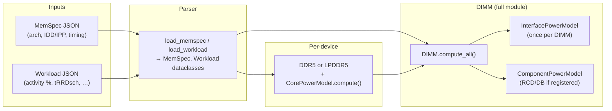
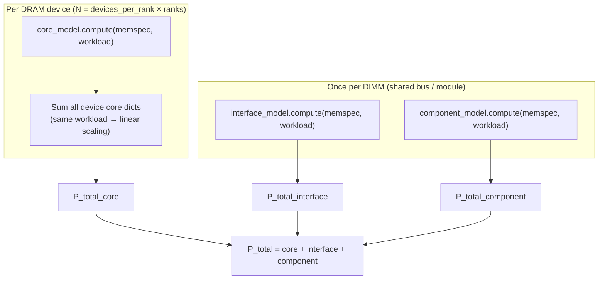
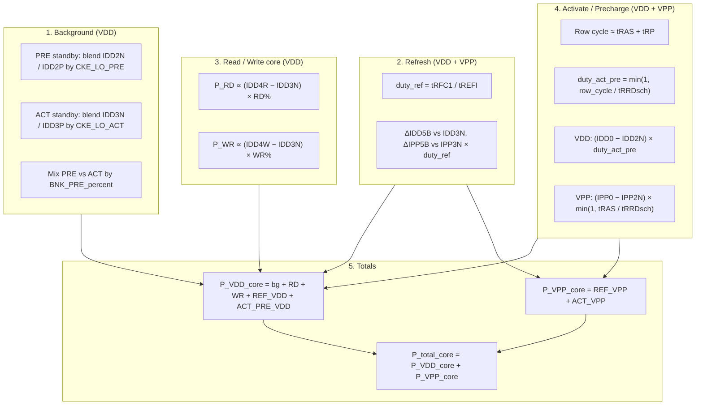

# Core Package — DDR5 / LPDDR5 Power Calculator

JEDEC-style DRAM power modeling: per-device **core** current (IDD/IPP), **interface** I/O power (DDR5), optional **component** power (registered DIMMs), and DIMM-level aggregation.

## How the package fits together

High-level flow from JSON inputs to reported power:



- **MemSpec** holds geometry (banks, ranks, device width), **MemPowerSpec** (IDD/IPP and rails), and **MemTimingSpec** (tCK, RAS, RP, RFC, REFI, …).
- **Workload** supplies steady-state activity fractions (bank precharge vs active, CKE-low, scheduled read/write share, `tRRDsch_ns`, etc.).

## DIMM aggregation (`DIMM.compute_all`)



**Core** is computed **per device** and summed. **Interface** and **component** power are computed **once** per DIMM (shared interface; RCD/DB on registered modules).

---

## DDR5 core power model (`DDR5CorePowerModel`)

The core model is **stateless**: `compute(memspec, workload)` returns a breakdown in watts. It uses JEDEC-style IDD/IPP deltas vs a nominal idle (IDD3N / IPP3N where applicable) and workload **duty** or **time fractions**.

### Structure of the calculation



### Main formulas (DDR5)

| Block | Idea | Typical form |
|--------|------|----------------|
| Background | Standby current in PRE vs ACT banks, CKE-high vs power-down | `P = VDD × I_blend(IDD2N/IDD2P or IDD3N/IDD3P)` weighted by `BNK_PRE_percent` |
| Refresh | Fraction of time in refresh | `duty_ref = (RFC×tCK) / (REFI×tCK)`; incremental IDD5B/IPP5B vs active nominal |
| Read / Write | Fraction of time doing RD/WR bursts | `VDD × (IDD4R/W − IDD3N) × RD/WR duty` |
| ACT/PRE | Row opens limited by `tRRDsch` | `duty_act_pre = min(1, (tRAS+tRP) / tRRDsch)` for VDD; VPP term uses `tRAS / tRRDsch` capped at 1 |

Returned keys include `P_RD_core`, `P_WR_core`, `P_REF_core`, `P_ACT_PRE_core`, `P_VDD_core`, `P_VPP_core`, `P_total_core`, and standby helpers.

---

## LPDDR5 core (`LPDDR5CorePowerModel`)

Same **logical** blocks (background, refresh, RD/WR increment, ACT/PRE), but **four rails** (VDD1, VDD2H, VDD2L, VDDQ) via `idd_by_rail_A` or scalar IDD fallback. No VPP rail. Outputs add per-rail totals such as `P_VDD1` … `P_VDDQ` and `P_total_core`.

---

## DDR5 interface model (`DDR5InterfacePowerModel`)

Two parts merged in `compute()`:

1. **Termination (resistive I²R)** — `calculate_termination_power`: POD-style assumption; power on DQ (read vs write attribution), CA, CK, WCK, DQS, CS; scales by pin counts (from architecture), `rd_duty` / `wr_duty`, and utilization.
2. **Dynamic (CV²f)** — `calc_interface_dynamic_power_swing`: `P ∝ N × C_eq × V² × f × α` per group (DQ, CA, CS, CK, DQS, WCK).

`P_total_interface = P_total_interface_term + P_total_interface_dyn`.

---

## Component model (`DDR5ComponentPowerModel`)

For **registered** DIMMs only: approximate **RCD** and **data buffer** power from DRAM-like IDD terms and workload activity; unregistered modules return zeros.

---

## Repository layout

```
core/
├── src/              # Package source (ddr5, dimm, core_model, interface_model, parser, …)
├── tests/            # Unit tests
├── verif/            # Verification vs baselines
├── workloads/        # Example MemSpec and workload JSON
└── requirements.txt
```

## Installation

```bash
cd core
pip install -e .
```

## Usage

```python
from ddr5 import DDR5
from core_model import DDR5CorePowerModel
from parser import load_memspec, load_workload

memspec = load_memspec("workloads/micron_16gb_ddr5_4800_x8_spec.json")
workload = load_workload("workloads/workload.json")

core_model = DDR5CorePowerModel()
ddr5 = DDR5(memspec, workload, core_model=core_model)
result = ddr5.compute_core()

print(f"Total core power: {result['P_total_core']} W")
```

End-to-end DIMM (core + interface + component) with CLI: `python -m main` from `core/src` or use `DIMM.load_specs(...)` as in `main.py`.

## Testing

```bash
cd core
pytest tests/ -v
python test_regression.py
```

Update regression baseline: `python test_regression.py --save-baseline`

## Dependencies

- pandas>=2.0.0  
- matplotlib>=3.7.0  
- numpy>=1.24.0  
