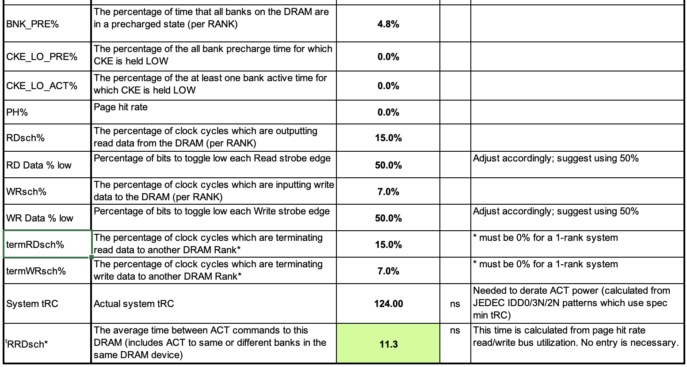
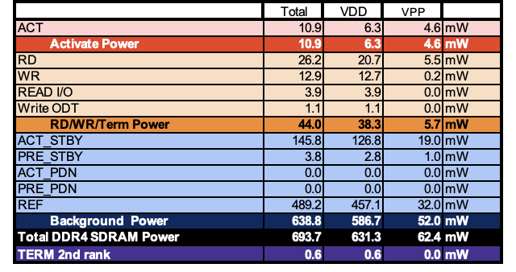

Micron ddr4 calculator

RD data % low is the percentage of bits to toggle low every read strobe.
sum of command time < 100% because states could be idle/

micron calculator uses google stress test. copied to workload.json

output from testing micron ddr4 calculator
